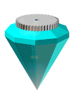

CrystalSCAD (deprecated)
===========

CrystalSCAD is a deprecated framework for programming 2d and 3d OpenSCAD models in Ruby.

I decided to start a new project becaues of:
- A programming language named Crystal appeared within the lifetime of this project
- The strict integration into rubyscad did more harm than good
- a big overhaul was due and would break old projects.

Check out jenncad, the successor to this project:
https://github.com/jglauche/jenncad

Installation:
===========

Dependencies:

- ruby 2 or higher
- rubygems

Install via gem:
### \# gem install crystalscad

Install via git:

- clone repository
- \# rake build
- \# gem install pkg/crystalscad-<version>.gem

Getting started
===========
CrystalSCAD comes with a generator that generates project stubs automatically for you. Run this command from a terminal in the directory that you want to create a project:

### \# crystalgen new [my_project_name]
Change [my_project_name] to the name of your project

A project named "my_project" will create those files and directories:

- my_project/my_project.rb - the controller
- my_project/lib/assemblies - for putting together assemblies of individual parts
- my_project/lib/electronics - put electronics here
- my_project/lib/hardware - put hardware parts in here
- my_project/lib/printed - put parts that you want to print in here
- my_project/lib/lasercut - put sheets that need to be cut (by laser or other) in here
- my_project/lib/assemblies/my_project_assembly.rb  - dummy assembly
- my_project/lib/printed/testcube.rb  - dummy printed part
- my_project/my_project.observr - observer file

Open up the controller (here my_project/my_project.rb ) in the text editor of your choice. It contains the information on how to start the observer.

Coding
===========
Nearly all OpenSCAD functions are implemented. You can use the same parameters as in OpenSCAD, although CrystalSCAD provides some convenient variable names like f.e. Diameter (d) for cylinders.

Some examples:

CSG Modeling:

  res = cylinder(d:10,h:10)
  # union
  res += cube(x:5,y:20,z:20)
  # difference
  res -= cylinder(d:5,h:10)
  # intersection
  res *= cylinder(d:10,h:10)

Chain transformations:
  res = cube([1,2,3]).rotate(x:90).translate(x:20,y:2,z:1).mirror(z:1)

Hull:
  res = hull(cylinder(d:10,h:10).cube([20,10,10].translate(x:10)))

Center cubes in X/Y direction only:
  cube([10,10,10]).center_xy # note: does only work on cubes and must be put before any transformations

Also implemented: center_x, center_y, center_z

Long slots:
  # produces a hull of two cylinders, 14mm apart
  long_slot(d:4.4,h:10,l:14)

A few tips:

- Be visual. Put your desired situation on the screen, then model your object around it
- On bigger project, do output multiple files automatically. Use .save(filename) to save openscad code of your desired objects
- When porting OpenScad code, beware of dividing integers. Example:
  cylinder(r=11/2,h=10);
  needs to be ported to
  cylinder(r:11.0/2,h:10)
  or
  cylinder(d:11,h:10)

License:
===========
GPLv3

